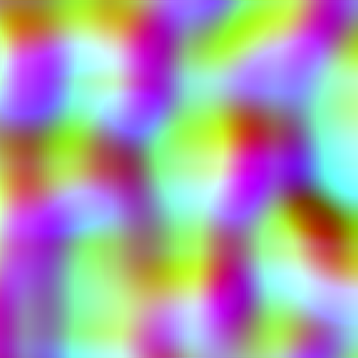
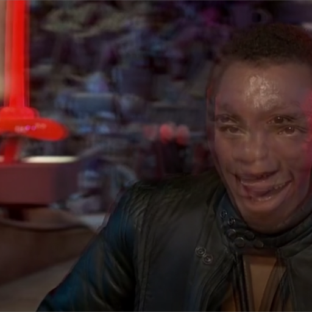
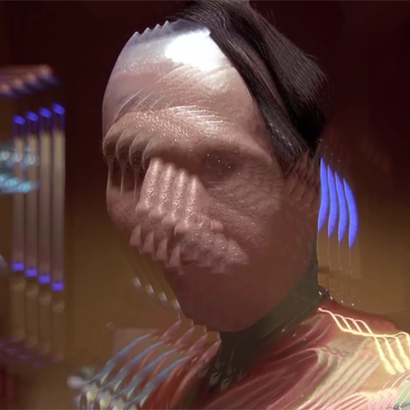
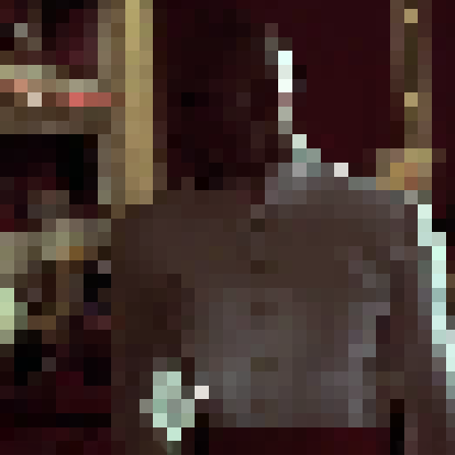

# Vjzual4 Modules

These modules are video generators and effects that can be easily dropped into a project.

The `.tox` files should be self-sufficient and do not need to be kept around as external files after they've been added
to a project (though you may want to do so anyway).

## Generators

These modules generate a video stream. Some of them accept optional input video sources.

### advanced_noise_gen

### multi_noise_gen

### noise_gen

### ramp_gen

### shape_gen

### voronoi

### video_player

## Effects

These modules take in a video stream and output it with some sort of modification. Some of them accept additional input
sources which they use in different ways.

### blend

### bloom

### color_adjust

### delay

### edge

### edge feedback

### feedback

### flip

### flow_abs

### fluid

### fract

### hex_grid

### iterate

### lfo

### linked_transform

### matte

### mirror

### multi_tap_delay

### multi_tap_warp

### oil

### recolor

### redux

### remap

### reproject

### sequenced_transform

### stutter

### switcher

### time_machine

### tint

### trails

### transform

### vignette

### voronoi_fx

### warp

## Mapping modules

These modules combine to form a projection mapping system.

### mapper_camera

### mapper_cell_panel

### mapper_render

